# Maskhot - Architecture Diagrams

This document contains Mermaid diagrams showing the relationships between all data structures in the Maskhot project.

---

## 1. High-Level System Overview

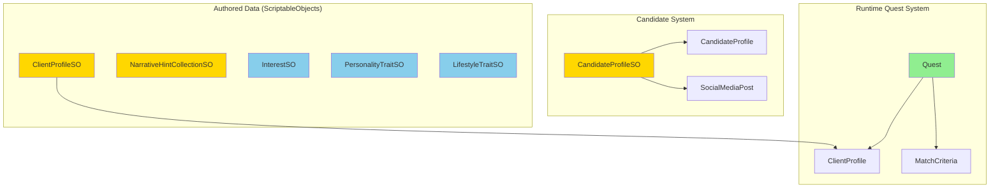

**Legend**:
- 🟢 Green: Runtime-generated classes
- 🟡 Yellow: ScriptableObject wrappers
- 🔵 Blue: Core trait ScriptableObjects

---

## 2. Quest System - Detailed

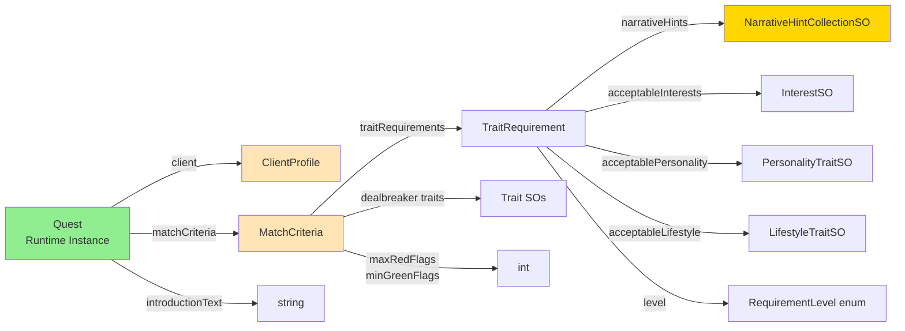

---

## 3. Client Profile System

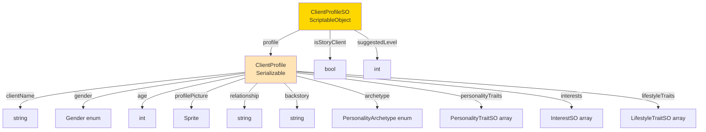

---

## 4. Candidate Profile System

```mermaid
graph TB
    CandidateSO[CandidateProfileSO<br/>ScriptableObject]
    Candidate[CandidateProfile<br/>Serializable]
    Post[SocialMediaPost<br/>Serializable]

    CandidateSO -->|profile| Candidate
    CandidateSO -->|guaranteedPosts| Post

    Candidate -->|characterName| Name[string]
    Candidate -->|gender| Gender[Gender enum]
    Candidate -->|age| Age[int]
    Candidate -->|bio| Bio[string]
    Candidate -->|profilePhoto| Sprite1[Sprite]
    Candidate -->|archetype| Arch[PersonalityArchetype enum]

    Candidate -->|personalityTraits| PT[PersonalityTraitSO array]
    Candidate -->|interests| IT[InterestSO array]
    Candidate -->|lifestyleTraits| LT[LifestyleTraitSO array]

    Post -->|postType| Type[PostType enum]
    Post -->|content| Content[string]
    Post -->|imageContent| Image[Sprite]
    Post -->|timestamp| Time[string]
    Post -->|likes/comments| Engagement[int]
    Post -->|isGreenFlag/isRedFlag| Flags[bool]
    Post -->|categories| Cat[PostCategory array]

    Post -->|relatedInterests| PostIT[InterestSO array]
    Post -->|relatedPersonalityTraits| PostPT[PersonalityTraitSO array]
    Post -->|relatedLifestyleTraits| PostLT[LifestyleTraitSO array]

    style CandidateSO fill:#FFD700
    style Candidate fill:#FFE4B5
    style Post fill:#FFE4B5
```

---

## 5. Trait System (ScriptableObjects)

```mermaid
graph TB
    subgraph "Trait ScriptableObjects"
        Interest[InterestSO]
        Personality[PersonalityTraitSO]
        Lifestyle[LifestyleTraitSO]
    end

    Interest -->|displayName| Name1[string]
    Interest -->|icon| Icon1[Sprite]
    Interest -->|description| Desc1[string]
    Interest -->|category| Cat1[InterestCategory enum]
    Interest -->|matchWeight| Weight1[int 1-10]
    Interest -->|relatedInterests| Related1[InterestSO array]

    Personality -->|displayName| Name2[string]
    Personality -->|icon| Icon2[Sprite]
    Personality -->|description| Desc2[string]
    Personality -->|isPositive| Pos[bool]
    Personality -->|matchWeight| Weight2[int 1-10]
    Personality -->|oppositeTrait| Opp[PersonalityTraitSO]
    Personality -->|complementaryTraits| Comp[PersonalityTraitSO array]

    Lifestyle -->|displayName| Name3[string]
    Lifestyle -->|icon| Icon3[Sprite]
    Lifestyle -->|description| Desc3[string]
    Lifestyle -->|category| Cat3[LifestyleCategory enum]
    Lifestyle -->|matchWeight| Weight3[int 1-10]
    Lifestyle -->|conflictingTraits| Conflict[LifestyleTraitSO array]
    Lifestyle -->|compatibleTraits| Compatible[LifestyleTraitSO array]

    style Interest fill:#87CEEB
    style Personality fill:#87CEEB
    style Lifestyle fill:#87CEEB
```

---

## 6. Narrative Hint System

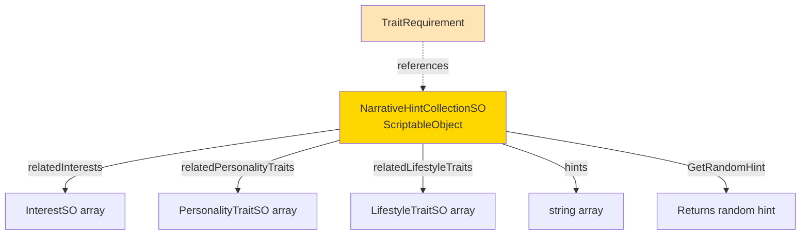

**Note**: NarrativeHintCollectionSO provides the abstract, player-facing text ("enjoys fine cuisine") while the backend trait references provide the concrete matching logic.

---

## 7. Match Criteria Deep Dive

```mermaid
graph TB
    Criteria[MatchCriteria]

    subgraph "Basic Preferences"
        Criteria -->|acceptableGenders| Genders[Gender array]
        Criteria -->|minAge/maxAge| Ages[int]
    end

    subgraph "Trait Requirements"
        Criteria -->|traitRequirements| TraitReq[TraitRequirement array]
        TraitReq -->|narrativeHints| Hints[NarrativeHintCollectionSO]
        TraitReq -->|acceptableInterests| AcceptInt[InterestSO array]
        TraitReq -->|acceptablePersonality| AcceptPer[PersonalityTraitSO array]
        TraitReq -->|acceptableLifestyle| AcceptLife[LifestyleTraitSO array]
        TraitReq -->|level| Level[RequirementLevel enum]
    end

    subgraph "Dealbreakers"
        Criteria -->|dealbreakerPersonalityTraits| DBPer[PersonalityTraitSO array]
        Criteria -->|dealbreakerInterests| DBInt[InterestSO array]
        Criteria -->|dealbreakerLifestyleTraits| DBLife[LifestyleTraitSO array]
    end

    subgraph "Red Flag Tolerance"
        Criteria -->|maxRedFlags| MaxRed[int]
        Criteria -->|minGreenFlags| MinGreen[int]
    end

    subgraph "Scoring Weights"
        Criteria -->|personalityWeight| PW[float 0-1]
        Criteria -->|interestsWeight| IW[float 0-1]
        Criteria -->|lifestyleWeight| LW[float 0-1]
    end

    style Criteria fill:#FFE4B5
    style Hints fill:#FFD700
```

---

## 8. Complete Data Flow (Gameplay)

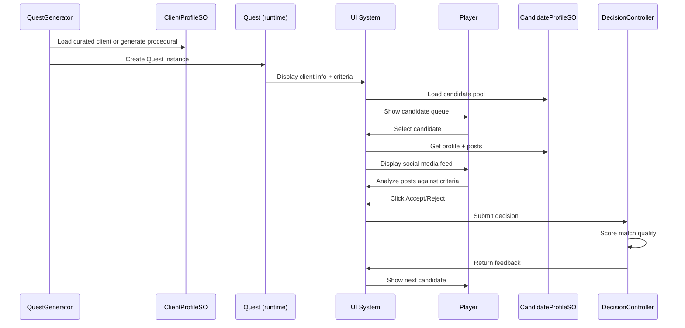

---

## 9. Trait Usage Across Systems

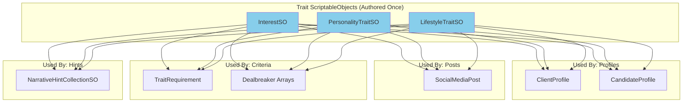

**Key Insight**: Trait ScriptableObjects are the central hub - they're referenced by almost every other system. This allows for:
- Consistency across the game
- Easy balancing (change matchWeight in one place)
- Type-safe references
- No string-based lookups

---

## 10. Procedural vs Curated Content Flow

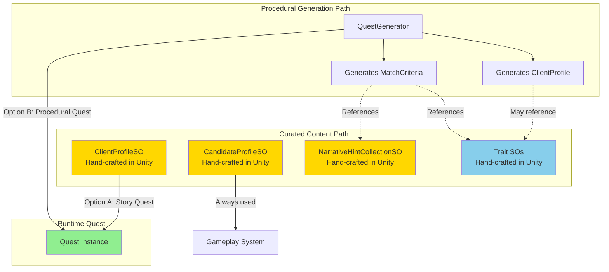

**Design Philosophy**:
- **Candidates**: Always curated (hand-crafted CandidateProfileSO with posts)
- **Clients**: Can be curated (ClientProfileSO for story) or procedural (generated ClientProfile)
- **Quests**: Always procedural (Quest instances created at runtime)
- **Traits**: Always curated (InterestSO, PersonalityTraitSO, LifestyleTraitSO)
- **Hints**: Always curated (NarrativeHintCollectionSO)

This hybrid approach allows for:
- Quick content creation (generate quests from authored traits/hints)
- Consistent quality (candidates are hand-crafted)
- Story flexibility (can use curated clients or go fully procedural)

---

## 11. Enums Reference

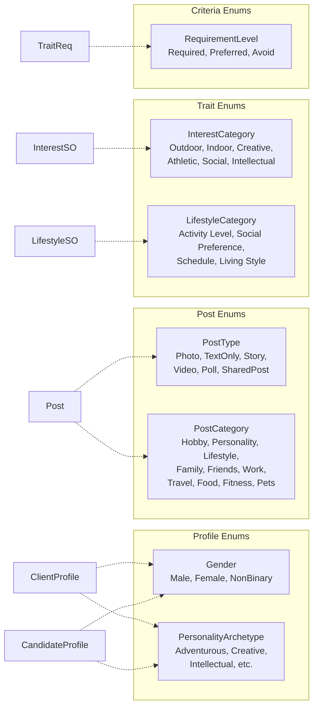

---

## Key Takeaways

1. **Central Hub**: Trait ScriptableObjects (InterestSO, PersonalityTraitSO, LifestyleTraitSO) are referenced by nearly every system

2. **Separation of Concerns**:
   - **Quest**: "Who wants what" (client + criteria)
   - **MatchCriteria**: "What they want" (abstract hints + concrete requirements)
   - **CandidateProfile**: "Who they are" (traits + bio)
   - **SocialMediaPost**: "What they show" (content + related traits)

3. **Abstraction Layers**:
   - **Player sees**: Narrative hints ("enjoys fine cuisine")
   - **Backend matches**: Trait references (Cooking InterestSO, Creative PersonalityTraitSO)
   - **Posts reveal**: Trait associations (post about cooking → Cooking interest)

4. **ScriptableObject Strategy**:
   - Traits: Always ScriptableObjects (shared, reusable)
   - Profiles: Wrapped in SOs for curation, but data is [Serializable] for procedural use
   - Quests: Pure runtime classes, no SO wrapper needed

5. **Type Safety**: All relationships use direct ScriptableObject references, never strings - prevents typos and breaks at edit-time, not runtime

---

## File Locations

**Core Data Classes** (Scripts/Data/):
- Quest.cs
- ClientProfile.cs
- CandidateProfile.cs
- MatchCriteria.cs
- SocialMediaPost.cs

**ScriptableObject Templates** (Scripts/Data/):
- ClientProfileSO.cs
- CandidateProfileSO.cs
- InterestSO.cs
- PersonalityTraitSO.cs
- LifestyleTraitSO.cs
- NarrativeHintCollectionSO.cs

**Authored Assets** (Assets/Data/ScriptableObjects/):
- Traits/ (InterestSO, PersonalityTraitSO, LifestyleTraitSO instances)
- NarrativeHints/ (NarrativeHintCollectionSO instances)
- Profiles/ (CandidateProfileSO instances)
- Clients/ (ClientProfileSO instances)

---

For more details, see:
- **PROJECT_SETUP.md** - Implementation status and backend details
- **SAMPLE_DATA.md** - Test data for creating ScriptableObject assets
- **UI_REFERENCE.md** - How these systems connect to the UI
