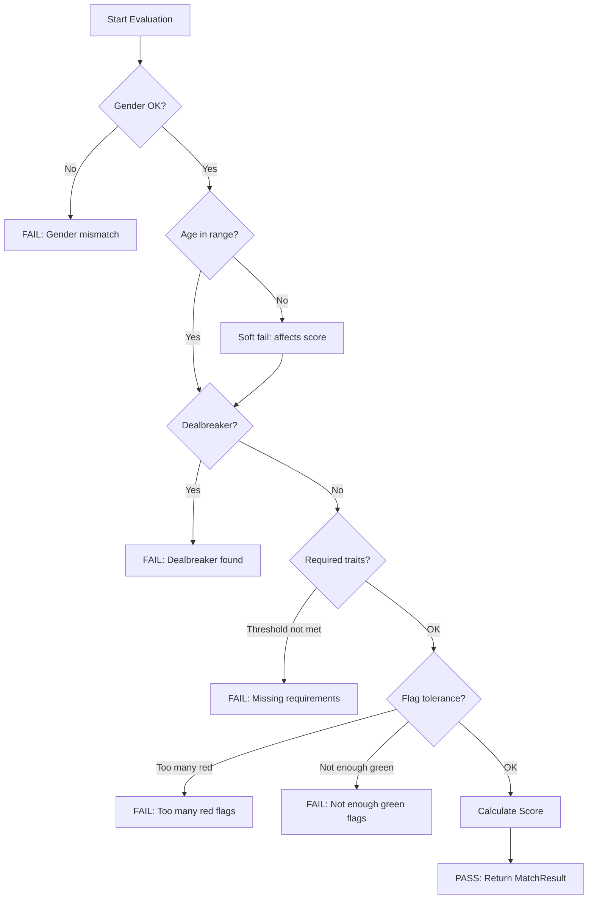

# Matching System

Evaluates candidates against match criteria and calculates scores.

## Overview

The matching system determines if a candidate is a valid match and how well they match. It checks requirements in order and calculates a 0-100 score.

## MatchEvaluator

Static utility class that performs all evaluation logic.

```csharp
// Assets/Scripts/Matching/MatchEvaluator.cs
public static class MatchEvaluator
{
    // Main evaluation method
    public static MatchResult Evaluate(CandidateProfileSO candidate, MatchCriteria criteria)

    // Convenience overload using client's criteria
    public static MatchResult Evaluate(CandidateProfileSO candidate, ClientProfileSO client)

    // Algorithm mode (see below)
    public static RequirementMode Mode { get; set; }
}
```

## Evaluation Pipeline

Checks are performed in order. If any hard check fails, evaluation stops early.



### 1. Gender Check (Hard)
Candidate's gender must be in `acceptableGenders[]`. Empty array = any gender OK.

### 2. Age Check (Soft)
If outside `minAge`-`maxAge` range, affects score but doesn't reject.

### 3. Dealbreaker Check (Hard)
If candidate has any trait in `dealbreakerPersonalityTraits`, `dealbreakerInterests`, or `dealbreakerLifestyleTraits`, they're rejected.

### 4. Required Traits Check
Depends on `RequirementMode` (see below).

### 5. Flag Counting
Counts `isRedFlag` and `isGreenFlag` posts from guaranteed posts.

### 6. Flag Tolerance Check (Hard)
- `RedFlagCount > maxRedFlags` → reject
- `GreenFlagCount < minGreenFlags` → reject

### 7. Score Calculation
Weighted combination of trait matches, bonuses, and penalties.

---

## Requirement Modes

Three modes for handling Required traits:

```csharp
public enum RequirementMode
{
    ExplicitThreshold,  // Uses minRequiredMet from criteria
    ImplicitSoftening,  // 1 Required = Preferred, 2+ = need at least 1
    ScoringOnly         // Required only affects score, never rejects
}
```

### ExplicitThreshold
Uses `MatchCriteria.minRequiredMet`:
- If `minRequiredMet = 0` (default): ALL Required traits must be met
- Otherwise: at least `minRequiredMet` Required traits must be met

### ImplicitSoftening (Current Mode)
- 1 Required trait: Always passes (treated as Preferred)
- 2+ Required traits: At least 1 must be met

### ScoringOnly
Required traits never cause rejection. They only affect the score.

**Change mode:**
```csharp
MatchEvaluator.Mode = RequirementMode.ScoringOnly;
```

---

## MatchResult

The result of evaluating a candidate.

```csharp
// Assets/Scripts/Matching/MatchResult.cs
public class MatchResult
{
    // Overall result
    public bool IsMatch { get; set; }
    public float Score { get; set; }  // 0-100

    // Failure reasons
    public bool HasDealbreaker { get; set; }
    public string DealbreakerTrait { get; set; }
    public bool GenderMismatch { get; set; }
    public bool AgeMismatch { get; set; }
    public int YearsOutsideAgeRange { get; set; }
    public bool TooManyRedFlags { get; set; }
    public bool NotEnoughGreenFlags { get; set; }
    public bool RequiredCheckFailed { get; set; }

    // Flag counts
    public int RedFlagCount { get; set; }
    public int GreenFlagCount { get; set; }

    // Trait tracking
    public List<string> FailedRequirements { get; set; }  // Hint text
    public List<string> MetRequirements { get; set; }
    public List<string> MetPreferences { get; set; }
    public List<string> MatchedAvoids { get; set; }

    // Score details
    public ScoreBreakdown Breakdown { get; set; }

    // Human-readable failure reason
    public string FailureReason { get; }
}
```

### ScoreBreakdown

```csharp
public class ScoreBreakdown
{
    public float PersonalityScore { get; set; }  // 0-100
    public float InterestsScore { get; set; }    // 0-100
    public float LifestyleScore { get; set; }    // 0-100

    public float PersonalityWeight { get; set; } // From criteria
    public float InterestsWeight { get; set; }
    public float LifestyleWeight { get; set; }

    public float PreferredBonus { get; set; }    // +5 per Preferred met
    public float AvoidPenalty { get; set; }      // -10 per Avoid matched
    public float RequiredBonus { get; set; }     // ScoringOnly mode
    public float RequiredPenalty { get; set; }   // ScoringOnly mode
    public float AgePenalty { get; set; }        // -3 per year outside range
}
```

---

## Scoring Formula

```
Base Score = 50

Weighted Score = (PersonalityScore * PersonalityWeight)
               + (InterestsScore * InterestsWeight)
               + (LifestyleScore * LifestyleWeight)

Final Score = Base + (Weighted * 0.5)
            + PreferredBonus - AvoidPenalty
            + RequiredBonus - RequiredPenalty
            - AgePenalty

Clamped to 0-100
```

### Constants
- `PREFERRED_BONUS = 5` per Preferred trait met
- `AVOID_PENALTY = 10` per Avoid trait matched
- `REQUIRED_MET_BONUS = 15` (ScoringOnly mode)
- `REQUIRED_FAILED_PENALTY = 10` (ScoringOnly mode)
- `AGE_PENALTY_PER_YEAR = 3`
- `BASE_SCORE = 50`

---

## Usage Example

```csharp
// Evaluate a candidate against a client
var result = MatchEvaluator.Evaluate(candidateSO, clientSO);

if (result.IsMatch)
{
    Debug.Log($"Match! Score: {result.Score}");
    Debug.Log($"Met preferences: {string.Join(", ", result.MetPreferences)}");
}
else
{
    Debug.Log($"Not a match: {result.FailureReason}");
}

// Check score breakdown
var breakdown = result.Breakdown;
Debug.Log($"Personality: {breakdown.PersonalityScore} * {breakdown.PersonalityWeight}");
Debug.Log($"Interests: {breakdown.InterestsScore} * {breakdown.InterestsWeight}");
Debug.Log($"Lifestyle: {breakdown.LifestyleScore} * {breakdown.LifestyleWeight}");
```

---

## File Locations

- **MatchEvaluator**: `Assets/Scripts/Matching/MatchEvaluator.cs`
- **MatchResult**: `Assets/Scripts/Matching/MatchResult.cs`
- **MatchCriteria**: `Assets/Scripts/Data/MatchCriteria.cs`
- **MatchingTester**: `Assets/Scripts/Testing/MatchingTester.cs`
