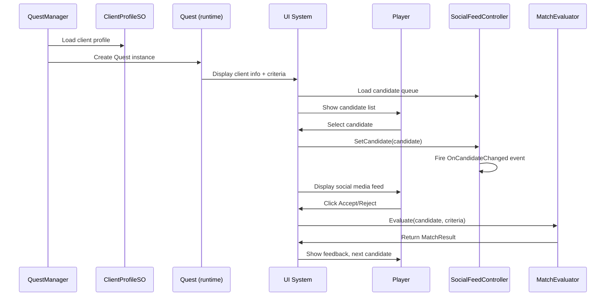
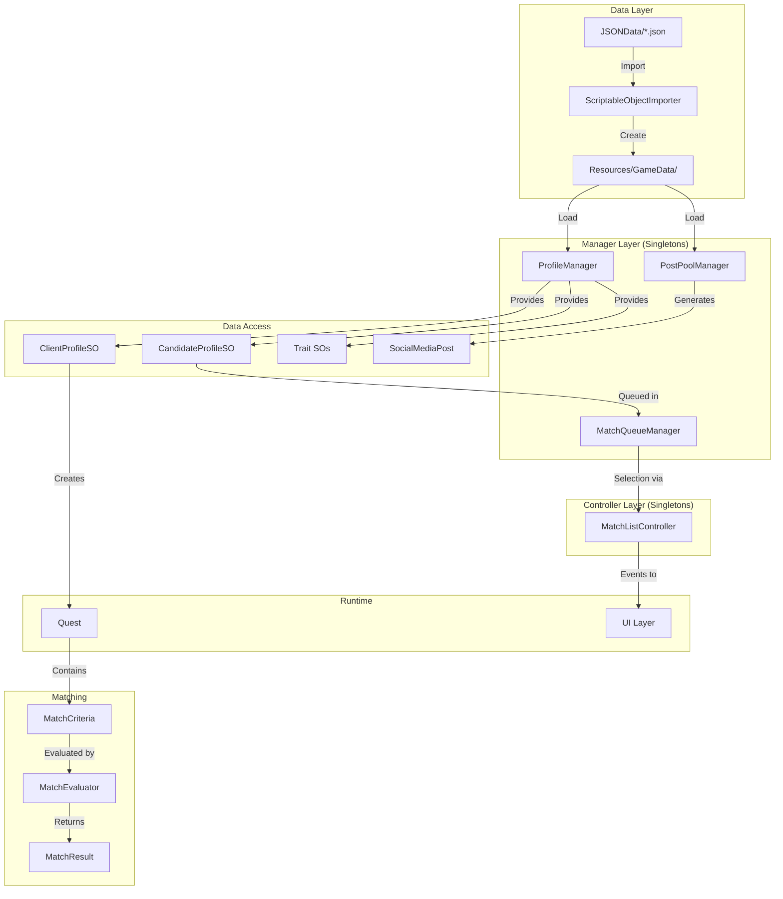
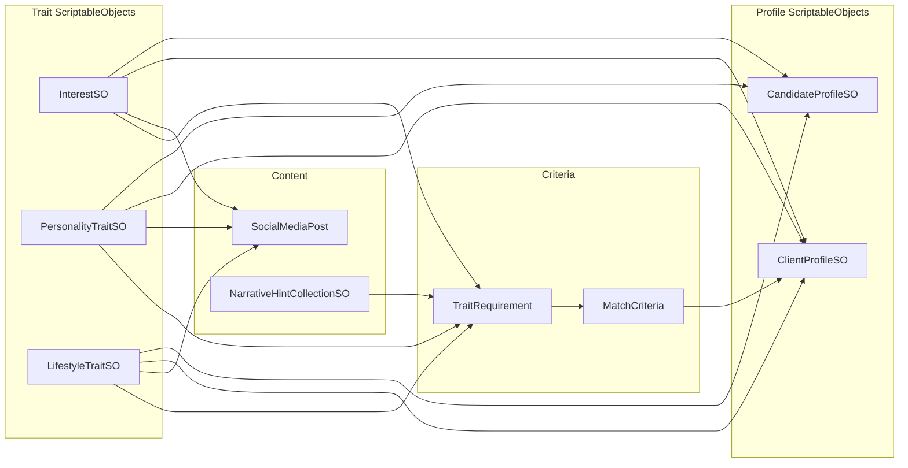

# Maskhot - System Overview

High-level diagrams showing how all systems connect. For implementation details, see the specific system docs.

## Game Flow

## System Architecture

## Data Relationships

## Key Design Principles

1. **Trait SOs are the hub** - Referenced by profiles, posts, criteria, and hints
2. **JSON is the source of truth** - Edit JSON, import to create SOs
3. **Managers handle data/logic** - ProfileManager, PostPoolManager, MatchQueueManager
4. **Controllers handle UI state** - MatchListController manages selection and fires events
5. **Separation of concerns**:
   - Quest = "Who wants what"
   - MatchCriteria = "What they want"
   - CandidateProfile = "Who the candidate is"
   - SocialMediaPost = "What they show"
   - MatchQueueManager = "Which candidates are available"
   - MatchListController = "Which candidate is selected"

## Related Docs

- [architecture.md](architecture.md) - Component patterns, dependency rules, conventions
- [profiles-and-traits.md](profiles-and-traits.md) - Profile and trait system details
- [matching-system.md](matching-system.md) - How matching and scoring works
- [quest-system.md](quest-system.md) - Quest structure and criteria
- [random-post-system.md](random-post-system.md) - Post generation system
- [data-import.md](data-import.md) - JSON import workflow
