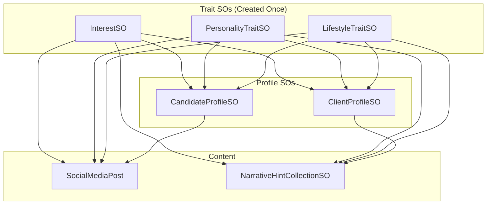

# Profiles and Traits System

The core data model for candidates, clients, and the traits that define them.

## Trait ScriptableObjects

Traits are the foundation - referenced by profiles, posts, criteria, and hints.

### InterestSO

Hobbies and activities.

```csharp
// Assets/Scripts/Data/InterestSO.cs
public class InterestSO : ScriptableObject
{
    public string displayName;
    public string description;
    public Sprite icon;
    public InterestCategory category;
    public int matchWeight;           // 1-10, affects scoring
    public InterestSO[] relatedInterests;
}
```

**Categories**: `Outdoor`, `Indoor`, `Creative`, `Athletic`, `Social`, `Intellectual`, `Entertainment`, `Food`

### PersonalityTraitSO

Character traits.

```csharp
// Assets/Scripts/Data/PersonalityTraitSO.cs
public class PersonalityTraitSO : ScriptableObject
{
    public string displayName;
    public string description;
    public Sprite icon;
    public bool isPositiveTrait;
    public int matchWeight;           // 1-10
    public PersonalityTraitSO[] oppositeTraits;
    public PersonalityTraitSO[] complementaryTraits;
}
```

**Special trait**: "Controversial" - Used for divisive/polarizing posts (replaces old category system)

### LifestyleTraitSO

Daily life patterns.

```csharp
// Assets/Scripts/Data/LifestyleTraitSO.cs
public class LifestyleTraitSO : ScriptableObject
{
    public string displayName;
    public string description;
    public Sprite icon;
    public LifestyleCategory category;
    public int matchWeight;           // 1-10
    public LifestyleTraitSO[] conflictingTraits;
    public LifestyleTraitSO[] compatibleTraits;
}
```

**Categories**: `Schedule`, `SocialPreference`, `HealthWellness`, `LivingStyle`

---

## Profile Data

### CandidateProfile (Serializable class)

The data inside a candidate profile.

```csharp
// Assets/Scripts/Data/CandidateProfile.cs
[Serializable]
public class CandidateProfile
{
    public string characterName;
    public Gender gender;
    public int age;
    public string bio;
    public Sprite profilePicture;
    public PersonalityArchetype archetype;
    public PersonalityTraitSO[] personalityTraits;
    public InterestSO[] interests;
    public LifestyleTraitSO[] lifestyleTraits;
}
```

### CandidateProfileSO (ScriptableObject wrapper)

The asset that holds a candidate profile plus social media data.

```csharp
// Assets/Scripts/Data/CandidateProfileSO.cs
[CreateAssetMenu(fileName = "NewCandidateProfile", menuName = "Maskhot/Candidate Profile")]
public class CandidateProfileSO : ScriptableObject
{
    public CandidateProfile profile;
    public List<SocialMediaPost> guaranteedPosts;  // Always appear

    // Random post settings
    public int randomPostMin = 2;
    public int randomPostMax = 5;

    // Social metrics (affects engagement)
    public int friendsCountMin = 100;
    public int friendsCountMax = 500;
}
```

**Key methods:**

```csharp
// Get profile picture (with gender-based fallback)
Sprite GetProfilePicture()

// Get all posts for this playthrough (guaranteed + random, cached)
List<SocialMediaPost> GetPostsForPlaythrough()

// Clear cached posts (call when starting new quest)
void ResetPlaythroughPosts()
```

### ClientProfile (Serializable class)

The client (friend) asking for a match.

```csharp
// Assets/Scripts/Data/ClientProfile.cs
[Serializable]
public class ClientProfile
{
    public string clientName;
    public Gender gender;
    public int age;
    public Sprite profilePicture;
    public string relationship;      // "College roommate", "Sister", etc.
    public string backstory;
    public PersonalityArchetype archetype;
    public PersonalityTraitSO[] personalityTraits;
    public InterestSO[] interests;
    public LifestyleTraitSO[] lifestyleTraits;
}
```

### ClientProfileSO (ScriptableObject wrapper)

```csharp
// Assets/Scripts/Data/ClientProfileSO.cs
[CreateAssetMenu(fileName = "NewClientProfile", menuName = "Maskhot/Client Profile")]
public class ClientProfileSO : ScriptableObject
{
    public ClientProfile profile;
    public bool isStoryClient = true;
    public int suggestedLevel = 1;
    public string introduction;       // What client says when asking
    public MatchCriteria matchCriteria;
}
```

---

## Social Media Posts

```csharp
// Assets/Scripts/Data/SocialMediaPost.cs
[Serializable]
public class SocialMediaPost
{
    public PostType postType;
    public string content;
    public Sprite postImage;
    public int daysSincePosted;       // 1 = yesterday, 7 = week ago
    public int likes;
    public int comments;

    // Trait associations
    public InterestSO[] relatedInterests;
    public PersonalityTraitSO[] relatedPersonalityTraits;
    public LifestyleTraitSO[] relatedLifestyleTraits;

    // Flag indicators
    public bool isRedFlag;
    public bool isGreenFlag;
}
```

**Post Types**: `Photo`, `TextOnly`, `Story`, `Video`, `Poll`, `SharedPost`

---

## Enums

```csharp
public enum Gender { Male, Female, NonBinary }

public enum PersonalityArchetype
{
    Adventurous, Creative, Intellectual,
    Nurturing, Analytical, Spontaneous, Ambitious
}

public enum InterestCategory
{
    Outdoor, Indoor, Creative, Athletic,
    Social, Intellectual, Entertainment, Food
}

public enum LifestyleCategory
{
    Schedule, SocialPreference, HealthWellness, LivingStyle
}
```

---

## ProfileManager

Singleton that loads and serves all profile/trait data.

```csharp
// Assets/Scripts/Managers/ProfileManager.cs
public class ProfileManager : MonoBehaviour
{
    public static ProfileManager Instance { get; }

    // Candidate access
    CandidateProfileSO[] GetAllCandidates()
    CandidateProfileSO GetCandidateByName(string name)
    CandidateProfileSO GetRandomCandidate()

    // Trait access
    InterestSO[] GetAllInterests()
    InterestSO GetInterestByName(string name)
    InterestSO[] GetInterestsByCategory(InterestCategory category)

    PersonalityTraitSO[] GetAllPersonalityTraits()
    PersonalityTraitSO GetPersonalityTraitByName(string name)
    PersonalityTraitSO[] GetPositivePersonalityTraits()
    PersonalityTraitSO[] GetNegativePersonalityTraits()

    LifestyleTraitSO[] GetAllLifestyleTraits()
    LifestyleTraitSO GetLifestyleTraitByName(string name)
    LifestyleTraitSO[] GetLifestyleTraitsByCategory(LifestyleCategory category)

    // Narrative hints
    NarrativeHintCollectionSO[] GetAllNarrativeHints()
    NarrativeHintCollectionSO[] GetHintsForTrait(ScriptableObject trait)

    // Session management
    void ResetAllCandidatePosts()  // Call when starting new quest
}
```

**Auto-loads from**: `Resources/GameData/`

---

## Data Flow Diagram



## File Locations

- **Data classes**: `Assets/Scripts/Data/`
- **ProfileManager**: `Assets/Scripts/Managers/ProfileManager.cs`
- **Loaded assets**: `Assets/Resources/GameData/`
