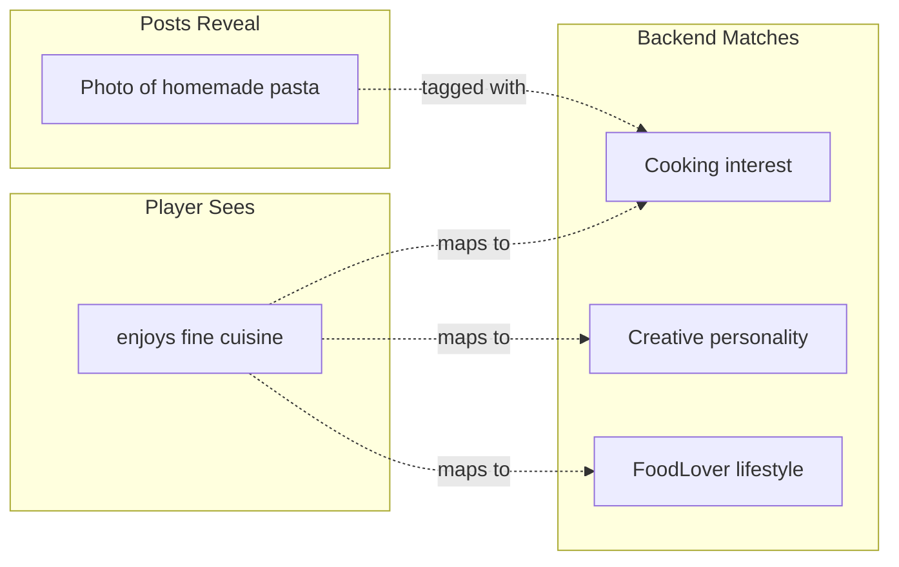
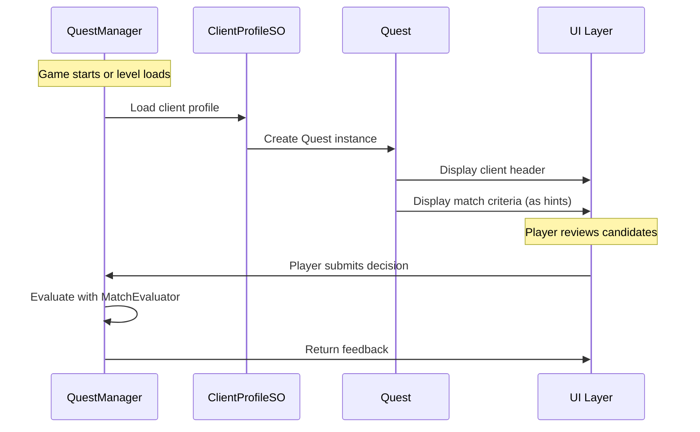

# Quest System

Quests combine a client (who's asking) with match criteria (what they want).

## Overview

A Quest is a runtime object that drives a matching session. It contains:
- The client asking for a match
- Their introduction text
- The criteria for finding a good match

## Quest Class

```csharp
// Assets/Scripts/Data/Quest.cs
[Serializable]
public class Quest
{
    public ClientProfile client;       // Who is asking
    public string introductionText;    // What they say
    public MatchCriteria matchCriteria; // What they want
}
```

### Factory Methods

```csharp
// Create from a curated ClientProfileSO
Quest.FromClientProfileSO(ClientProfileSO clientSO, string intro, MatchCriteria criteria)

// Create a fully procedural quest
Quest.CreateProcedural(ClientProfile proceduralClient, string intro, MatchCriteria criteria)
```

---

## MatchCriteria

Defines what the client is looking for.

```csharp
// Assets/Scripts/Data/MatchCriteria.cs
[Serializable]
public class MatchCriteria
{
    // Basic preferences
    public Gender[] acceptableGenders;
    public int minAge = 18;
    public int maxAge = 50;

    // Trait requirements (abstract hints + concrete traits)
    public TraitRequirement[] traitRequirements;
    public int minRequiredMet = 0;  // 0 = all Required must be met

    // Dealbreakers (auto-reject)
    public PersonalityTraitSO[] dealbreakerPersonalityTraits;
    public InterestSO[] dealbreakerInterests;
    public LifestyleTraitSO[] dealbreakerLifestyleTraits;

    // Red flag tolerance
    public int maxRedFlags = 2;
    public int minGreenFlags = 0;

    // Scoring weights (should sum to ~1.0)
    public float personalityWeight = 0.33f;
    public float interestsWeight = 0.33f;
    public float lifestyleWeight = 0.34f;
}
```

---

## TraitRequirement

Maps abstract player-facing hints to concrete trait requirements.

```csharp
[Serializable]
public class TraitRequirement
{
    // Player sees this (one hint randomly selected)
    public NarrativeHintCollectionSO narrativeHints;

    // Backend matches against these (ANY one satisfies)
    public InterestSO[] acceptableInterests;
    public PersonalityTraitSO[] acceptablePersonalityTraits;
    public LifestyleTraitSO[] acceptableLifestyleTraits;

    // How important
    public RequirementLevel level = RequirementLevel.Preferred;
}

public enum RequirementLevel
{
    Required,   // Must have - candidate fails without this
    Preferred,  // Nice to have - bonus points if matched
    Avoid       // Should not have - penalty if matched
}
```

---

## NarrativeHintCollectionSO

Provides abstract, player-facing text for requirements.

```csharp
// Assets/Scripts/Data/NarrativeHintCollectionSO.cs
[CreateAssetMenu(fileName = "NewHintCollection", menuName = "Maskhot/Narrative Hint Collection")]
public class NarrativeHintCollectionSO : ScriptableObject
{
    // Related traits (for organization/lookup)
    public InterestSO[] relatedInterests;
    public PersonalityTraitSO[] relatedPersonalityTraits;
    public LifestyleTraitSO[] relatedLifestyleTraits;

    // Hint variations
    public string[] hints;

    // Get a random hint for display
    public string GetRandomHint() => hints[Random.Range(0, hints.Length)];
}
```

**Example collections:**
- `Cooking_Hints`: ["enjoys fine cuisine", "loves gourmet food", "foodie at heart"]
- `EarlyRiser_Hints`: ["morning person", "early bird", "loves sunrise"]
- `ActiveLifestyle_Hints`: ["stays active", "loves the outdoors", "fitness enthusiast"]

**Important**: Each collection should map to ONE trait or COMPATIBLE traits only. Don't mix opposites (e.g., "morning person" and "night owl" in the same collection).

---

## The Abstraction Layer

The quest system provides two layers:



**Player flow:**
1. See hint: "enjoys fine cuisine"
2. Browse candidate's posts
3. Find post about cooking with Cooking interest tag
4. Infer: this candidate matches the hint

---

## Quest Flow



---

## QuestManager

Singleton manager that handles quest lifecycle and client data.

```csharp
// Assets/Scripts/Managers/QuestManager.cs
namespace Maskhot.Managers
{
    public class QuestManager : MonoBehaviour
    {
        public static QuestManager Instance { get; private set; }

        // Properties
        public Quest CurrentQuest { get; }
        public bool HasActiveQuest { get; }
        public int ClientCount { get; }

        // Events
        public event Action<Quest> OnQuestStarted;
        public event Action<Quest> OnQuestCompleted;
        public event Action OnQuestCleared;

        // Quest management
        public void StartQuest(ClientProfileSO client);
        public void StartQuest(Quest quest);  // For procedural quests
        public void CompleteQuest();
        public void ClearQuest();

        // Client lookup
        public ClientProfileSO[] GetAllClients();
        public ClientProfileSO GetClientByName(string name);
        public ClientProfileSO[] GetStoryClients();
        public ClientProfileSO[] GetClientsForLevel(int level);
        public ClientProfileSO GetRandomClient();
        public ClientProfileSO GetRandomStoryClient();
    }
}
```

### Usage Example

```csharp
// Start a quest from a specific client
var client = QuestManager.Instance.GetClientByName("Emma");
QuestManager.Instance.StartQuest(client);

// Or start from a random story client
var randomClient = QuestManager.Instance.GetRandomStoryClient();
QuestManager.Instance.StartQuest(randomClient);

// Populate the queue for this quest
MatchQueueManager.Instance.PopulateForQuest(QuestManager.Instance.CurrentQuest, 5);

// When player finishes all decisions
QuestManager.Instance.CompleteQuest();
```

### Events

| Event | When Fired |
|-------|------------|
| `OnQuestStarted` | After `StartQuest()` creates and sets the current quest |
| `OnQuestCompleted` | After `CompleteQuest()` marks the quest as done |
| `OnQuestCleared` | After `ClearQuest()` abandons the quest without completion |

---

## Creating Quests

### From Curated ClientProfileSO

```csharp
// Load a story client
var clientSO = ProfileManager.Instance.GetClientByName("Marcus");

// Create quest using client's predefined criteria
var quest = Quest.FromClientProfileSO(
    clientSO,
    clientSO.introduction,
    clientSO.matchCriteria
);
```

### Procedural Quest (Future)

```csharp
// Generate a random client
var proceduralClient = new ClientProfile
{
    clientName = "Random Friend",
    // ... fill in traits
};

// Generate criteria
var criteria = new MatchCriteria
{
    acceptableGenders = new[] { Gender.Male },
    // ... fill in requirements
};

var quest = Quest.CreateProcedural(proceduralClient, "Help me find someone!", criteria);
```

---

## ClientProfileSO

The asset that holds curated client data.

```csharp
// Assets/Scripts/Data/ClientProfileSO.cs
[CreateAssetMenu(fileName = "NewClientProfile", menuName = "Maskhot/Client Profile")]
public class ClientProfileSO : ScriptableObject
{
    public ClientProfile profile;
    public bool isStoryClient = true;
    public int suggestedLevel = 1;
    public string introduction;        // What client says
    public MatchCriteria matchCriteria; // What they want
}
```

---

## File Locations

- **Quest**: `Assets/Scripts/Data/Quest.cs`
- **MatchCriteria**: `Assets/Scripts/Data/MatchCriteria.cs`
- **NarrativeHintCollectionSO**: `Assets/Scripts/Data/NarrativeHintCollectionSO.cs`
- **ClientProfileSO**: `Assets/Scripts/Data/ClientProfileSO.cs`
- **QuestManager**: `Assets/Scripts/Managers/QuestManager.cs`
- **QuestManagerTester**: `Assets/Scripts/Testing/QuestManagerTester.cs`
- **Client data**: `JSONData/Clients.json`
- **Hint data**: `JSONData/NarrativeHints.json`
