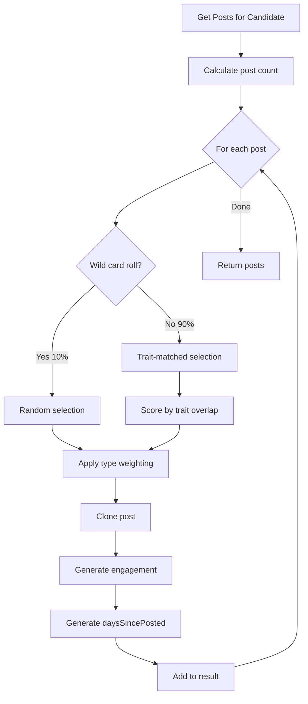

# Random Post System

Generates trait-matched random posts for candidates from a global pool.

## Overview

Each candidate has:
- **Guaranteed posts** - Always appear, defined in the profile
- **Random posts** - Selected from a global pool based on trait matching

Random posts add variety while maintaining consistency with the candidate's personality.

## PostPoolManager

Singleton that handles random post selection.

```csharp
// Assets/Scripts/Managers/PostPoolManager.cs
public class PostPoolManager : MonoBehaviour
{
    public static PostPoolManager Instance { get; }

    // Configuration
    public float wildCardChance = 0.1f;        // 10% chance to ignore trait matching
    public float photoWeight = 0.1f;           // 10% photo, 90% text (adjust in Inspector)
    public float baseEngagementMultiplier = 0.1f;
    public float commentToLikeRatio = 0.1f;
    public bool verboseLogging = false;

    // Methods
    List<SocialMediaPost> GetRandomPostsForCandidate(CandidateProfileSO candidate)
    void ResetPool()                           // Call when starting new quest
    int AvailablePostCount { get; }
}
```

---

## How Post Selection Works



### 1. Post Count
Randomly chosen between `candidate.randomPostMin` and `candidate.randomPostMax`.

### 2. Wild Card (10%)
Ignores trait matching, picks any available post. Adds unexpected variety.

### 3. Trait Matching (90%)
Scores each post by trait overlap with the candidate:
```
score = sum of matchWeight for each matching trait
```
Higher scoring posts are more likely to be selected (weighted random).

### 4. Type Weighting
After trait matching, applies photo vs text preference:
- `photoWeight = 0.1` → 10% photo posts, 90% text posts (configurable in Inspector)

### 5. Cloning
Posts are cloned before modification to preserve the original pool.

### 6. Engagement Generation
Based on candidate's friends count:
```
likes = friendsCount * baseEngagementMultiplier * randomFactor
comments = likes * commentToLikeRatio * randomFactor
```

Modifiers:
- Green flag posts: +30% engagement
- Red flag posts: variable (polarizing)
- Photo posts: +20% engagement

### 7. Timestamp Generation
`daysSincePosted` is generated to interleave with guaranteed posts.

### 8. Photo Image Selection
Photo posts automatically select an appropriate image based on content and traits:

1. **Dog-related** → `Dog.png` (keywords: dog, puppy, pup, canine, pupper, doggo; category: Animals)
2. **Travel-related** → `Santorini sunset.png` (keywords: travel, sunset, vacation, trip, adventure; category: Travel/Outdoor)
3. **Default** → Random selection from all available images (deterministic based on content hash)

Images are loaded from `Resources/Sprites/Posts/`. The `DisplayImage` property in `SocialMediaPost` handles selection automatically.

---

## Session-Based Uniqueness

Posts are tracked per session. Once used, a post won't appear again until `ResetPool()` is called.

```csharp
// At start of new quest
PostPoolManager.Instance.ResetPool();
ProfileManager.Instance.ResetAllCandidatePosts();
```

---

## CandidateProfileSO Integration

```csharp
// Random post settings on CandidateProfileSO
public int randomPostMin = 2;
public int randomPostMax = 5;
public int friendsCountMin = 100;
public int friendsCountMax = 500;
```

### GetPostsForPlaythrough()

Combines guaranteed + random posts, sorted by `daysSincePosted`:

```csharp
public List<SocialMediaPost> GetPostsForPlaythrough()
{
    // Return cached if already generated this session
    if (cachedPlaythroughPosts != null)
        return cachedPlaythroughPosts;

    // Combine guaranteed + random
    List<SocialMediaPost> allPosts = new List<SocialMediaPost>(guaranteedPosts);
    if (PostPoolManager.Instance != null)
    {
        allPosts.AddRange(PostPoolManager.Instance.GetRandomPostsForCandidate(this));
    }

    // Sort by date (most recent first)
    cachedPlaythroughPosts = allPosts.OrderBy(p => p.daysSincePosted).ToList();
    return cachedPlaythroughPosts;
}
```

### Caching

Posts are cached for the session. Switching between candidates preserves their posts. Call `ResetPlaythroughPosts()` to clear.

---

## RandomPostPoolSO

The data container for the global post pool.

```csharp
// Assets/Scripts/Data/RandomPostPoolSO.cs
[CreateAssetMenu(fileName = "RandomPostPool", menuName = "Maskhot/Random Post Pool")]
public class RandomPostPoolSO : ScriptableObject
{
    public List<SocialMediaPost> posts = new List<SocialMediaPost>();
}
```

**Location**: `Assets/Resources/GameData/PostPool/RandomPostPool.asset`

**Source**: Imported from `JSONData/RandomPosts.json` (1000 posts)

---

## Adding Random Posts

1. Edit `JSONData/RandomPosts.json`:
```json
{
  "posts": [
    {
      "postType": "Photo",
      "content": "Beautiful sunset at the beach!",
      "relatedInterests": ["Photography", "Travel"],
      "relatedPersonalityTraits": ["Optimistic"],
      "relatedLifestyleTraits": [],
      "isGreenFlag": true,
      "isRedFlag": false
    }
  ]
}
```

2. Run import: `Tools > Maskhot > Import Data from JSON`

---

## File Locations

- **PostPoolManager**: `Assets/Scripts/Managers/PostPoolManager.cs`
- **RandomPostPoolSO**: `Assets/Scripts/Data/RandomPostPoolSO.cs`
- **Post data**: `JSONData/RandomPosts.json`
- **Asset location**: `Assets/Resources/GameData/PostPool/RandomPostPool.asset`
- **Tester**: `Assets/Scripts/Testing/RandomPostTester.cs`
